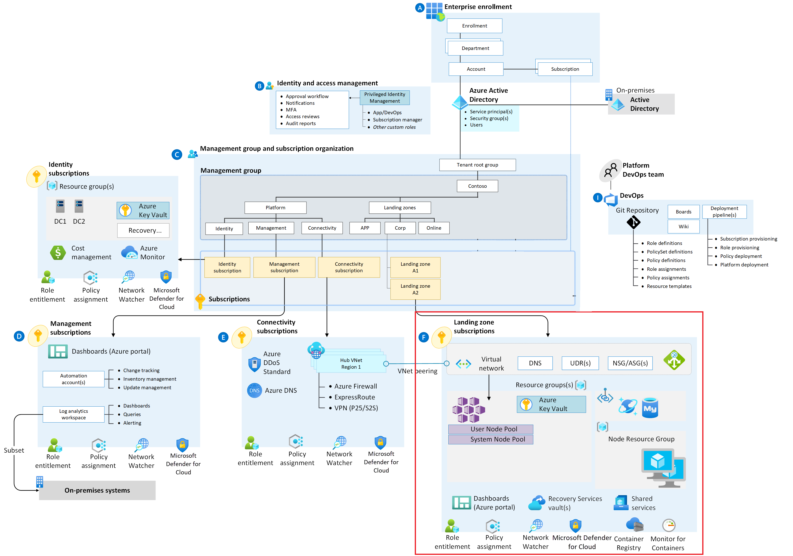
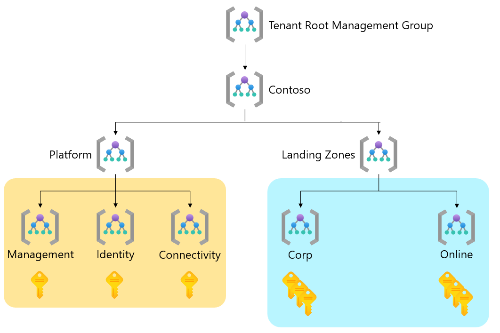
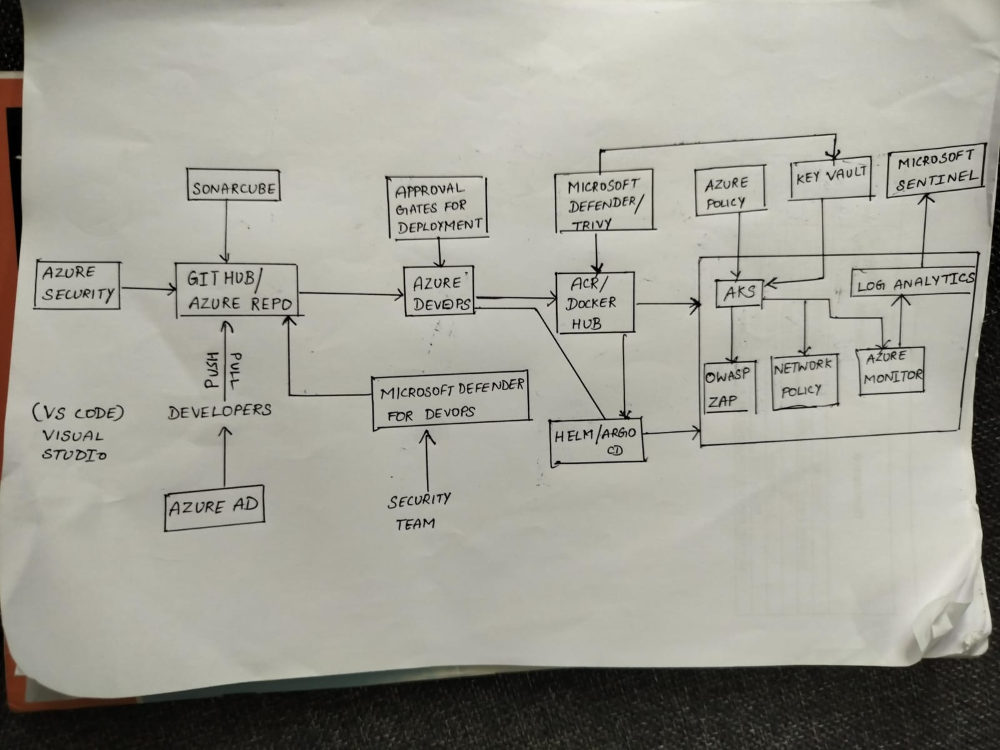

# Azure Cloud Infrastructure Design #

**Landing Zone:**

The landing zone represents the initial environment setup where all resources will be deployed. In Azure, this is often organized using the following components:

+ Tenant: Azure Active Directory (AAD) Tenant - Represents your organization's identity and access management.

+ Management Group: Organizational structure for managing Azure resources. It helps in applying policies and governance across subscriptions.

**Sample**

**Platform landing zone:** 
A platform landing zone is a subscription that provides shared services (identity, connectivity, management) to applications in application landing zones. Consolidating these shared services often improves operational efficiency. One or more central teams manage the platform landing zones. In the conceptual architecture (see figure 1), the "Identity subscription", "Management subscription", and "Connectivity subscription" represent three different platform landing zones. The conceptual architecture shows these three platform landing zones in detail. It depicts representative resources and policies applied to each platform landing zone.

**Application landing zone:** 
An application landing zone is a subscription for hosting an application. You pre-provision application landing zones through code and use management groups to assign policy controls to them. In the conceptual architecture (see figure 1), the "Landing zone A1 subscription" and "Landing zone A2 subscription" represent two different application landing zones. The conceptual architecture shows only the "Landing zone A2 subscription" in detail. It depicts representative resources and policies applied to the application landing zone.

**Sample** 

**Subscriptions:**

Multiple subscriptions can be created based on the needs for isolation, billing, and resource separation. For instance:

+ Connectivity Subscription: Contains networking resources like virtual networks, gateways, etc.

+ Application Subscriptions: Used for hosting applications and services, including the Managed Kubernetes cluster.

**Networking:**
Networking components are crucial for establishing connectivity between various resources. In Azure, this typically includes:

+ Virtual Network (VNET): Segmented networking environment to host resources. It could be configured with subnets for different purposes (e.g., backend, frontend, Kubernetes pods).

+ Gateway/Subnet: To connect on-premises resources or provide connectivity to the internet.

+ Load Balancers: For distributing traffic to Kubernetes nodes and other services.

**Managed Kubernetes (AKS):**
Azure Kubernetes Service (AKS) will be utilized for the managed Kubernetes solution:

+ AKS Cluster: Managed Kubernetes cluster for hosting containerized applications.

+ Node Pools: Different node pools for specific workloads or resource requirements.

**Deployment Architecture:**
+ Application Workloads: Deployed and managed within the AKS Cluster.

+ Storage Services: Utilize Azure Storage for persistent storage needs of the applications.

+ Monitoring & Logging: Incorporate Azure Monitor and Azure Log Analytics for performance monitoring and logging.

**Security & Identity:**

+ Azure Active Directory Integration: Enables identity and access management for resources.

+ Network Security Groups (NSGs): Controls inbound and outbound traffic to the resources within the VNET.

+ Azure Key Vault: For securely storing and managing sensitive information like secrets, keys, and certificates.

+ Azure Security Center: Monitors and enhances the security posture of the environment.

This is a high-level overview of the Azure cloud infrastructure design for Managed Kubernetes and associated resources.

**Application Architecture:**
1. Microservice Architecture:

    + Config Servers: Centralized configuration management.
    + Gateway Servers: Routing and API management.
    + Service Discovery Servers: Registration and lookup of services.
2. Logging Management:

    + Centralized Logging Service: Aggregation and analysis of application logs.
    + Log Storage: Storage for logs with appropriate retention policies.

**DevSecOps Tools:**
1. CI (Continuous Integration):

    + Tool (e.g., Azure DevOps, Jenkins): Automate builds and tests on code commits.
    + Unit Tests, Integration Tests: Part of CI pipelines for quality checks.

2. Code Quality:

    + Static Code Analysis Tools + (e.g., SonarQube): 
    Identify and fix code quality issues.
    + Code Review Processes: Incorporate peer reviews in CI pipelines.

3. Artifacts Server:

    + Artifact Repository (e.g., Azure Artifacts, Nexus): 
Store build artifacts and dependencies.

4. Security Check:

    +  Static Application Security Testing (SAST), Dynamic Application Security Testing (DAST): Scanning for vulnerabilities.
    + Dependency Scanning: Identifying and patching vulnerable dependencies.
5. CD (Continuous Delivery/Deployment):

    + Deployment Orchestration (e.g., Azure Pipelines, GitLab CI/CD): Automated deployment pipelines.
    + Manual Approval Gates: Ensuring controlled releases in the deployment process.

## Architecture

**AKS PCI Baseline Architecture**

[PCI Baseline](https://github.com/mspnp/aks-baseline)

**Deployment Workflow**

**DevOps Pipeline & Jobs**

